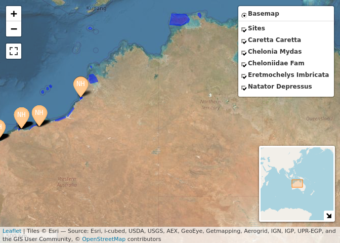
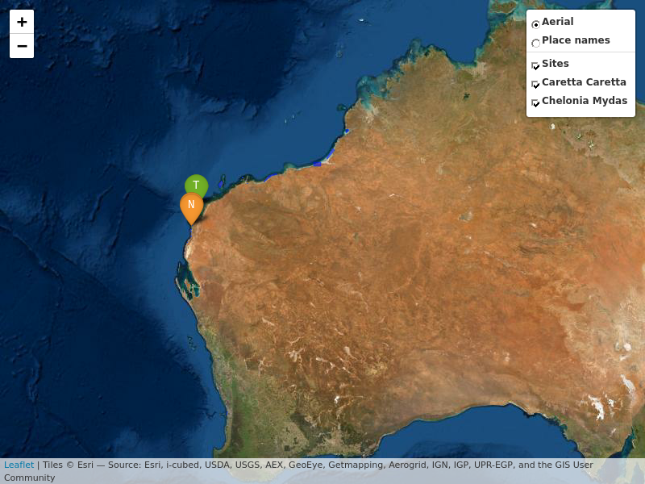

# wastdr 

<!-- badges: start -->

[](https://www.repostatus.org/#active)
[](https://github.com/dbca-wa/wastdr/issues)
[](https://github.com/dbca-wa/wastdr/commits/master)
[](https://github.com/dbca-wa/wastdr/actions)
[](https://codecov.io/gh/dbca-wa/wastdr)
<!-- badges: end -->

The [WA Strandings Database WAStD](https://wastd.dbca.wa.gov.au/)
([github](https://github.com/dbca-wa/wastd/)) provides a [RESTful
API](https://wastd.dbca.wa.gov.au/api/1/). WAStD contains data about
turtle strandings, turtle taggings, turtle track and nest encounters,
and some ancillary data (areas, surveys, staff). WAStD is accessible to
authenticated staff of the WA Department of Biodiversity, Conservation
and Attractions. The WAStD API uses token and basic authentication, see
vignette on details.

The API returns spatially explicit data as GeoJSON, which can be loaded
directly into any standard-compliant GIS environments, e.g. [Quantum
GIS](http://www.qgis.org/en/site/).

If the data consumer however wishes to analyse data in a statistical
package like R, the data need to be transformed from a nested list of
lists (GeoJSON properties) into a two-dimensional tabular structure.
This requires knowledge about the structure and content of the nested
data from WAStD.

The main purpose of `wastdr` is to facilitate reading, parsing and using
WAStD data by providing helpers to access the API and flatten the API
outputs into a [tidy](http://vita.had.co.nz/papers/tidy-data.html)
`dplyr::tibble`.

The secondary purpose of `wastdr` is to centralize a collection of
commonly used analyses and visualisations of turtle data. As development
progresses, example analyses and visualisations will be added to the
vignette. Contributions and requests are welcome\!

Lastly, to facilitate collaboration with external stakeholders, `wastdr`
contains some anonymized example data (raw GeoJSON and parsed `tibble`)
of turtle taggings, turtle track counts, and turtle nests.

## Installation

Install `wastdr` from GitHub:

``` r
# install.packages("devtools")
remotes::install_github(
    "dbca-wa/wastdr",
    dependencies = TRUE,
    upgrade = "always",
    build_vignettes = TRUE
)
```

While the WAStD API is only accessible to a selected audience, and
`wastdr` is under active development, it is not feasible to release
`wastdr` on CRAN yet. Therefore, `wastdr` will be distributed via GitHub
for the time being.

## Setup

`wastdr` requires to be configured with the WAStD API URL and an access
token or a username / password combination. `wastdr` functions expect
these settings to be available as environment variables. For
convenience, `wastdr_setup` sets the correct variables, while
`wastdr_settings` retrieves the currently set values.

DBCA staff can find their WAStD API Token at
[WAStD](https://wastd.dbca.wa.gov.au/) under “My Profile” and add to
their `.Renviron`. To use ODK Central turtle data download helpers, also
add ODK Central credentials.

``` r
WASTDR_API_URL="https://wastd.dbca.wa.gov.au/api/1/"
WASTDR_API_TOKEN="Token XXX"
WASTDR_VERBOSE=TRUE

ODKC_URL="https://odkcentral.dbca.wa.gov.au"
ODKC_UN="..."
ODKC_PW="..."
```

External collaborators can use their allocated WAStD username and
password:

``` r
WASTDR_API_URL="https://wastd.dbca.wa.gov.au/api/1/"
WASTDR_API_UN="..."
WASTDR_API_PW="..."
WASTDR_VERBOSE=TRUE

ODKC_URL="https://odkcentral.dbca.wa.gov.au"
ODKC_UN="..."
ODKC_PW="..."
```

Review the settings with:

``` r
wastdr::wastdr_settings()
#> <wastdr settings>
#>   WAStD URL:     https://tsc.dbca.wa.gov.au/ 
#>   API URL:       https://wastd.dbca.wa.gov.au/api/1/ 
#>   API Token:     see wastdr::get_wastdr_api_token()
#>   API Username:  FlorianM 
#>   API Password:  see wastdr::get_wastdr_api_pw()
#>   Verbose:       TRUE
```

For other configuration methods please see the vignette “Setup”.

## Get WAStD

Once set up, `wastdr` can load data from WAStD simply with:

``` r
tracks <- "turtle-nest-encounters" %>% 
    wastd_GET(max_records = 10) %>%  
    parse_turtle_nest_encounters()
```

Valid endpoints are listed in the base API URL of WAStD, e.g.:

  - `encounters`
  - `animal-encounters`
  - `turtle-nest-encounters`
  - `turte-nest-disturbance-observations`

## …or have a pickle

If you don’t have access to the WAStD API, you can still get a feel for
the data by using the pickled example data:

``` r
library(wastdr)

data("wastd_data")
data("odkc_data")

wastd_data$animals
#> # A tibble: 1,000 x 46
#>    area_name area_type area_id site_name site_type site_id survey_id
#>    <chr>     <chr>       <int> <chr>     <chr>       <int>     <int>
#>  1 Barrow I… Locality       41 <NA>      <NA>           NA        NA
#>  2 Barrow I… Locality       41 <NA>      <NA>           NA        NA
#>  3 Mundabul… Site           42 <NA>      <NA>           NA        NA
#>  4 Mundabul… Site           42 <NA>      <NA>           NA        NA
#>  5 Mundabul… Site           42 <NA>      <NA>           NA        NA
#>  6 Barrow I… Locality       41 <NA>      <NA>           NA        NA
#>  7 Barrow I… Locality       41 <NA>      <NA>           NA        NA
#>  8 Barrow I… Locality       41 <NA>      <NA>           NA        NA
#>  9 Barrow I… Locality       41 <NA>      <NA>           NA        NA
#> 10 Mundabul… Site           42 <NA>      <NA>           NA        NA
#> # … with 990 more rows, and 39 more variables: survey_start_time <dttm>,
#> #   survey_end_time <dttm>, survey_start_comments <chr>,
#> #   survey_end_comments <chr>, datetime <dttm>, calendar_date_awst <chr>,
#> #   turtle_date <date>, season <dbl>, season_week <dbl>, iso_week <dbl>,
#> #   longitude <dbl>, latitude <dbl>, crs <chr>, location_accuracy <dbl>,
#> #   location_accuracy_m <dbl>, taxon <chr>, name <chr>, species <chr>,
#> #   health <chr>, sex <chr>, maturity <chr>, habitat <chr>, activity <chr>,
#> #   behaviour <chr>, comments <chr>, nesting_event <chr>,
#> #   checked_for_injuries <chr>, scanned_for_pit_tags <chr>,
#> #   checked_for_flipper_tags <chr>, cause_of_death <chr>,
#> #   cause_of_death_confidence <chr>, absolute_admin_url <chr>, obs <list>,
#> #   source <chr>, source_id <chr>, encounter_type <chr>, status <chr>,
#> #   observer <chr>, reporter <chr>
wastd_data$tracks
#> # A tibble: 1,000 x 56
#>    type      pk source source_id encounter_type status when  latitude longitude
#>    <chr>  <int> <chr>  <chr>     <chr>          <chr>  <chr>    <dbl>     <dbl>
#>  1 Feat… 159497 odk    uuid:836… nest           new    2010…    -20.3      119.
#>  2 Feat… 159498 odk    uuid:281… nest           new    2010…    -20.3      119.
#>  3 Feat… 159499 odk    uuid:19d… nest           new    2010…    -20.3      119.
#>  4 Feat…     80 paper  2015-10-… nest           proof… 2015…    -21.6      115.
#>  5 Feat…    314 odk    uuid:f23… nest           curat… 2016…    -32.1      116.
#>  6 Feat…    315 odk    uuid:c6f… nest           curat… 2016…    -32.1      116.
#>  7 Feat…    316 odk    uuid:ef5… nest           new    2016…    -32.0      116.
#>  8 Feat…    317 odk    uuid:a5c… nest           new    2016…    -32.0      116.
#>  9 Feat…    318 odk    uuid:c6e… nest           new    2016…    -32.0      116.
#> 10 Feat…    319 odk    uuid:829… nest           new    2016…    -32.0      116.
#> # … with 990 more rows, and 47 more variables: crs <chr>,
#> #   location_accuracy <chr>, leaflet_title <chr>, observer_pk <chr>,
#> #   observer_username <chr>, observer_name <chr>, reporter_pk <chr>,
#> #   reporter_username <chr>, reporter_name <chr>, comments <chr>,
#> #   area_pk <int>, area_area_type <chr>, area_name <chr>, site_pk <int>,
#> #   site_area_type <chr>, site_name <chr>, survey_id <int>,
#> #   survey_site_pk <int>, survey_site_area_type <chr>, survey_site_name <chr>,
#> #   survey_start_time <chr>, survey_end_time <chr>,
#> #   survey_start_comments <chr>, survey_reporter_pk <chr>,
#> #   survey_reporter_username <chr>, survey_reporter_name <chr>,
#> #   survey_absolute_admin_url <chr>, survey_production <lgl>, nest_age <chr>,
#> #   nest_type <chr>, species <chr>, habitat <chr>, disturbance <chr>,
#> #   nest_tagged <chr>, logger_found <chr>, eggs_counted <chr>,
#> #   hatchlings_measured <chr>, fan_angles_measured <chr>,
#> #   absolute_admin_url <chr>, datetime <dttm>, calendar_date_awst <chr>,
#> #   turtle_date <date>, season <dbl>, season_week <dbl>, iso_week <dbl>,
#> #   species_colours <chr>, nest_type_text <chr>

wastd_data$tracks %>% map_tracks(sites = wastd_data$sites)
```

<!-- -->

``` r
odkc_data$tracks %>% map_tracks_odkc(sites = odkc_data$sites)
```

<!-- -->

## Learn more

See the vignette for built-in helpers to transform, analyze and
visualize WAStD data.

``` r
vignette("getting-wastd", package = "wastdr")
vignette("analysis", package = "wastdr")
```

# Contribute

Every contribution, constructive feedback, or suggestion is welcome\!

Send us your ideas and requests as
[issues](https://github.com/dbca-wa/wastdr/issues) or submit a pull
request.

Pull requests should eventually pass tests and checks (not introducing
new ERRORs, WARNINGs or NOTEs apart from the “New CRAN package” NOTE):

``` r
styler:::style_pkg()
spelling::spell_check_package()
spelling::update_wordlist()
devtools::document(roclets = c("rd", "collate", "namespace", "vignette"))
devtools::build()
devtools::test()
# devtools::check(force_suggests = T, args = c("--as-cran", "--timings"))
goodpractice::goodpractice(quiet = F)
covr::codecov(token = Sys.getenv("CODECOV_TOKEN"))
```

To enable local testing of the API as well as checking and upload of
test coverage, add your CODECOV token to your .Renviron:

``` r
CODECOV_TOKEN = "my-codecov-token"
```

The `wastdr` [webpage](https://dbca-wa.github.io/wastdr/) is hosted on
gh-pages and generated using
[pkgdown](https://github.com/hadley/pkgdown).
